# Internship Portal

## 📌 Overview
The **Internship Portal** is a web application designed to connect students with valuable internship opportunities. It provides an efficient platform for students to explore, apply, and track their internship applications while allowing companies to manage listings and select candidates.

## 🚀 Features

### 🎓 Student Module
- User Registration & Login  
- Search & Apply for Internships  
- Track Application Status  
- Manage Profile & Bookmarks  
- Provide Feedback

### 🏢 Company Module
- Register & Manage Internship Listings  
- Select Candidates  
- Provide Feedback to Students

### 🛠️ Admin Module
- Manage Students, Companies, & Internships  
- Verify Users & Internship Listings

## 🛠️ Technologies Used
- **Backend:** Python - Django Framework 🐍  
- **Frontend:** HTML5, CSS4, Bootstrap 5, JavaScript  
- **Database:** MySQL 8.0  
- **Tools:** Visual Studio Code  

## 📸 Screenshots

### 🏠 Home Page  
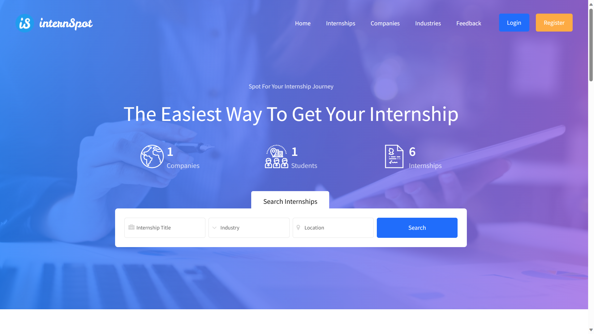

### 🆕 Student Register  
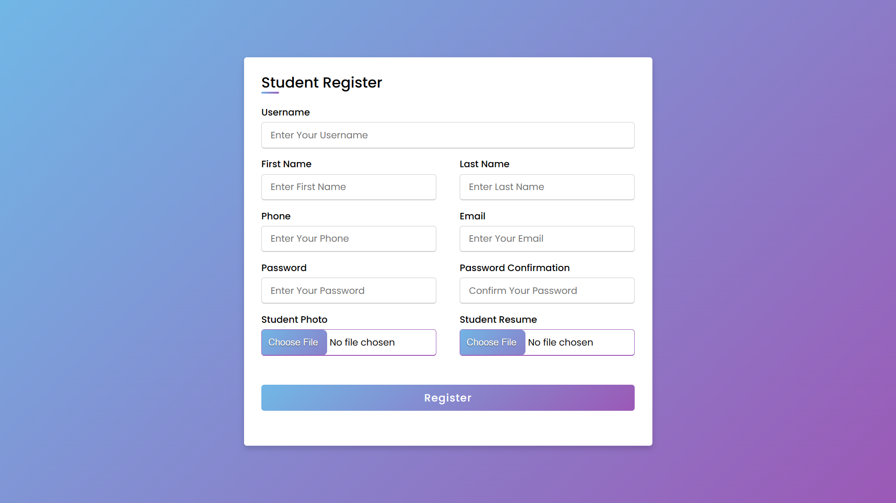

### 🔐 Student Login  
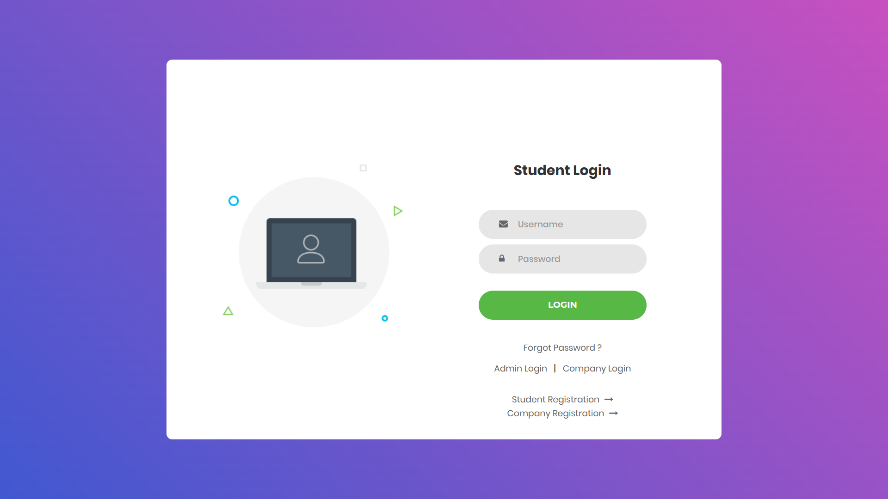

### 👤 Student Profile  
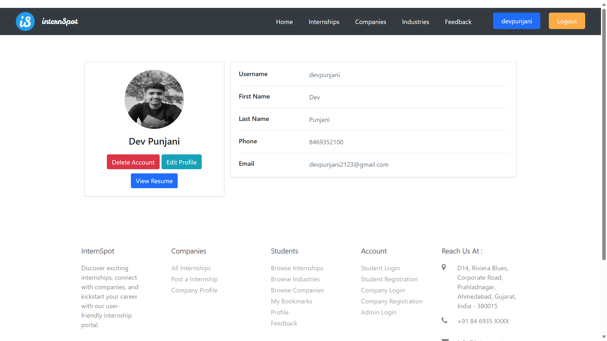

### 📝 Company Register  
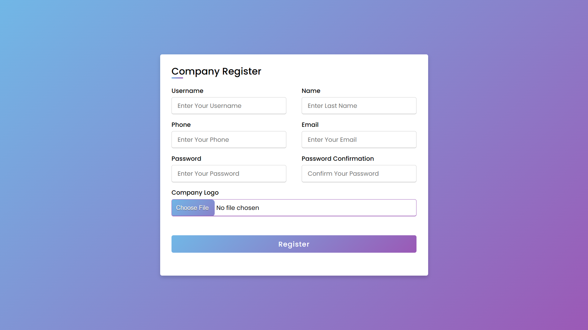

### 🔐 Company Login  
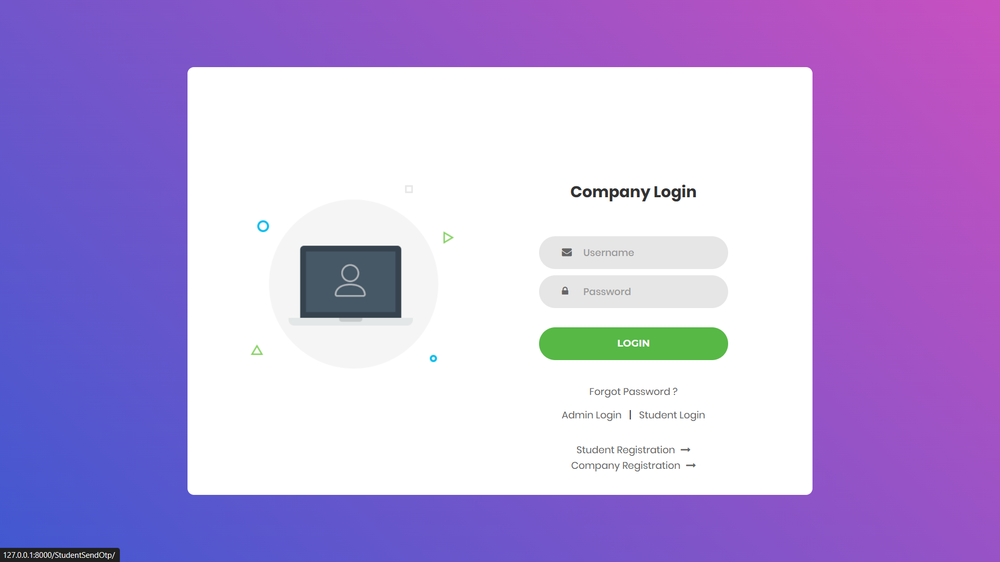

### 🏢 Company Dashboard  
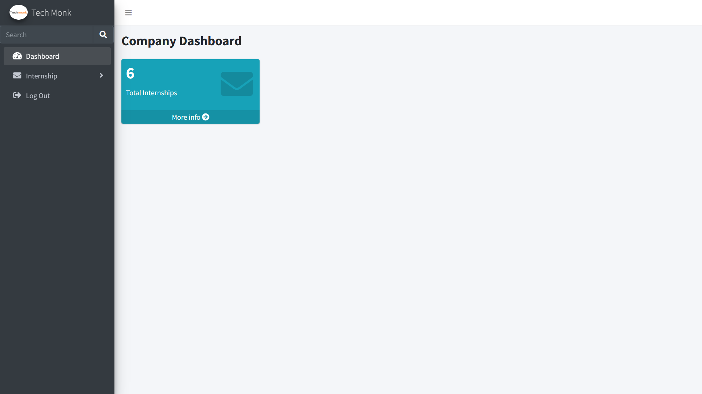

### 🔐 Admin Login  
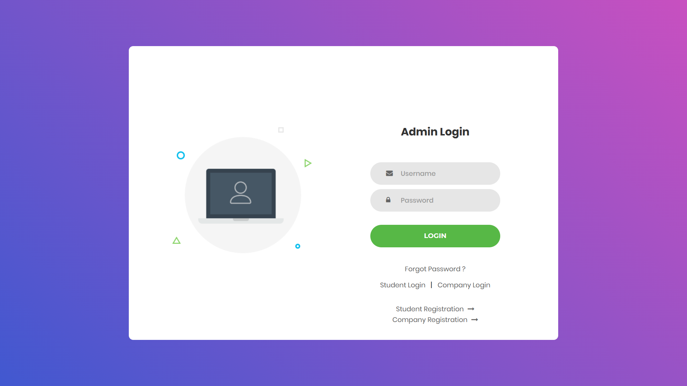

### 🖥️ Admin Dashboard  
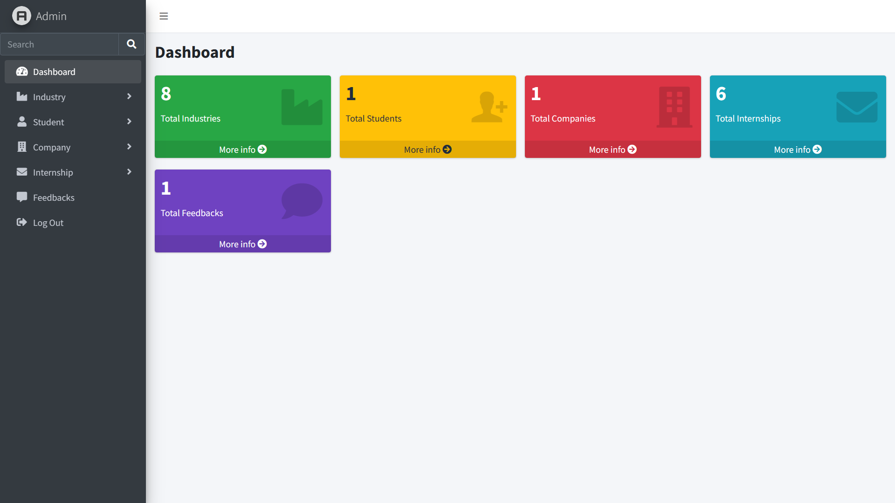

### 🔁 Forgot Password  

### 🔢 OTP Verification  
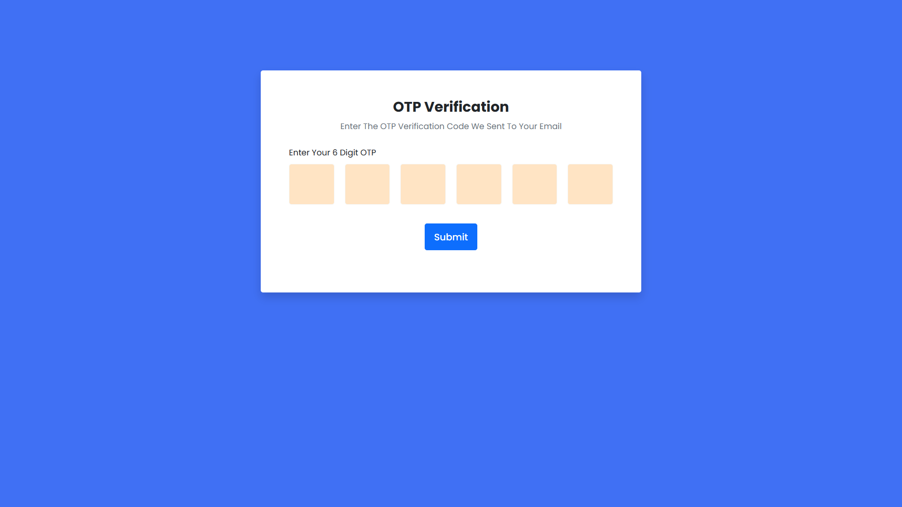

### 💬 Feedback  
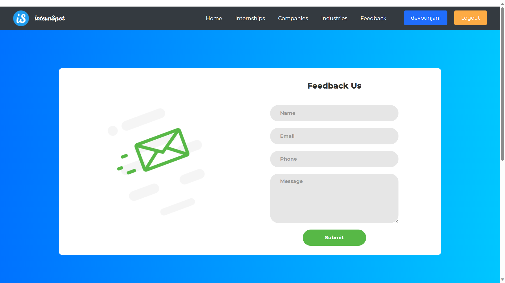
